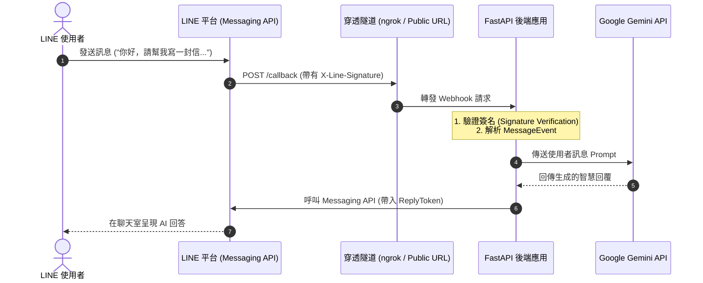
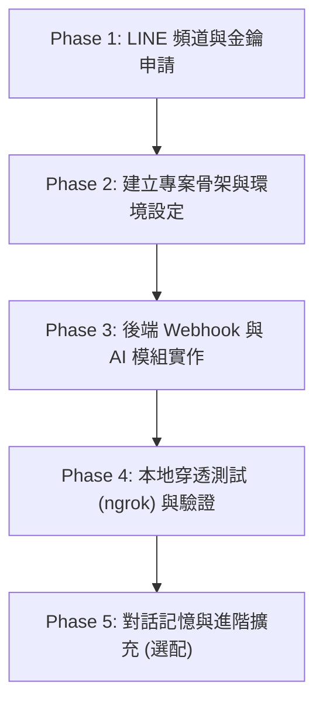

# 專案規劃：AI 智慧助理 LINE Bot (FastAPI + Gemini)

本規劃旨在建構一個以 **Python (FastAPI)** 為後端、串接 **Google Gemini**（或 OpenAI）自然語言模型的智慧 LINE 官方帳號機器人。以下為完整的建構路線與逐步操作指引。

---

## 系統架構與流程



---

## 實作階段規劃



---

### Phase 1: LINE Developers 帳號與頻道設定 (約 10 分鐘)

1. **登入平台**：前往 [LINE Developers Console](https://developers.line.biz/) 並以既有 LINE 帳號登入。
2. **建立 Provider (提供者)**：
   - 點擊 **Create a new provider**，輸入團隊或個人名稱（例如：`Personal-Dev`）。
3. **建立 Messaging API Channel**：
   - 在 Provider 內點擊 **Create a Messaging API channel**。
   - 填寫 Channel 名稱（即機器人顯示名稱）、說明、類別，並上傳頭像。
4. **取得金鑰資訊**：
   - **Channel Secret**：在 **Basic settings** 分頁最下方，點擊複製。
   - **Channel Access Token**：在 **Messaging API** 分頁最下方，點擊 **Issue** 產生長期存取權限 Token（Long-lived token）並複製。
5. **關鍵設定調整 (必做)**：
   - 前往 **Messaging API** 分頁中的 **LINE Official Account features**：
     - **Auto-reply messages**（自動回應訊息）：請設定為 **Disabled**（關閉），避免 LINE 預設的罐頭訊息干擾。
     - **Use webhook**：設定為 **Enabled**（啟用）。

---

### Phase 2: 專案目錄結構與環境建置

建議於目前工作目錄建立專屬子目錄 `line-ai-bot/`：

```
line-ai-bot/
├── .env                  # 機密金鑰 (LINE Secret, Token, Gemini API Key)
├── .env.example          # 環境變數範本
├── requirements.txt      # Python 套件清單
├── main.py               # FastAPI 主程式與 Webhook 路由
└── services/
    ├── __init__.py
    ├── ai_service.py     # 處理 Gemini / OpenAI 對話生成邏輯
    └── line_service.py   # 封裝 line-bot-sdk 回覆邏輯
```

#### 核心相依套件 (`requirements.txt`)
- `fastapi` & `uvicorn[standard]`：高效能非同步 Web 框架。
- `line-bot-sdk>=3.14.0`：官方最新 v3 SDK（支援非同步與現代 API 規格）。
- `google-genai` 或 `google-generativeai`：Gemini 官方客戶端。
- `python-dotenv`：載入環境變數。

---

### Phase 3: 核心功能實作

1. **環境變數驗證 (`.env`)**：
   - `LINE_CHANNEL_SECRET`
   - `LINE_CHANNEL_ACCESS_TOKEN`
   - `GEMINI_API_KEY` (可於 [Google AI Studio](https://aistudio.google.com/) 免費申請)
2. **Signature 驗證機制**：
   - 在 `/callback` 路由接收原始 request body 與 `X-Line-Signature`，確保請求確實來自 LINE 伺服器，防止惡意注入。
3. **AI 生成與例外處理**：
   - 設計重試機制與備用回覆（若模型超過流量限制或敏感詞攔截時，回傳友善提示）。
   - 回應長度控制（LINE 單則文字上限為 5000 字元）。

---

### Phase 4: 本機測試與 Webhook 穿透 (ngrok)

1. **啟動本機伺服器**：
   ```bash
   uvicorn main:app --reload --port 8000
   ```
2. **啟動隧道**：
   ```bash
   ngrok http 8000
   ```
3. **回填 Webhook URL**：
   - 複製 ngrok 產生的網址（例如 `https://xxxx.ngrok-free.app/callback`）。
   - 貼至 LINE Developers 的 **Webhook URL** 欄位，勾選 **Use webhook**。
   - 點擊 **Verify**，確認回傳 HTTP 200。
4. **手機加入好友並測試**：
   - 掃描 Messaging API 分頁上的 QR Code 加入好友，傳送訊息進行實測。

---

### Phase 5: 進階功能規劃 (後續可選)

- **多輪對話記憶 (Chat Memory)**：利用 SQLite 或 Redis 快取使用者的最近對話歷史。
- **多模態識別 (Multimodal)**：使用者傳送照片時，呼叫 Gemini Vision 進行圖片解讀與問答。
- **雲端免費/低延遲部署**：將專案部署至 Render / Zeabur，免開電腦 24 小時在線運作。
